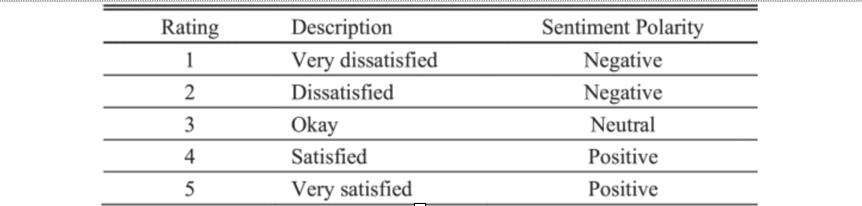
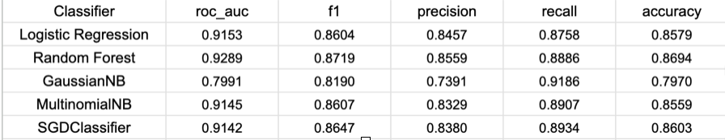
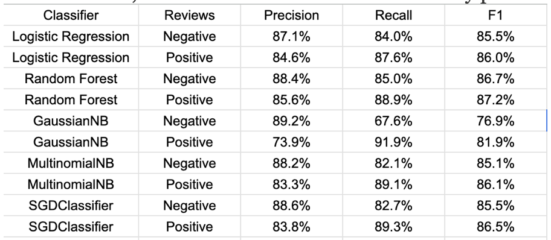

# ML_suicide_prevention_apps
Using machine learning to analyze app reviews for suicide prevention apps 
## Data Extractions 
Using Apple app store and Google play store api to obtain the user reviews of suicide prevention related apps.

## Data Extraction results

- Positive:85665
- Negative:21141
- Neutral:4216
## Data processing(refer to data_pro.ipynb)
1. Stripped punctuation, special symbols, and unnecessary spaces.
2. Normalized excessive character repetitions (for instance, transforming “toooo goooood” to “too good”).
3. Excluded numerical values.
4. Substituted slang terms with their standard English equivalents using the referenced no slang dictionary.
5. Unpacked contractions (such as converting “oughtn’t” to “ought not” and “there’s” to “there is”).
6. Transitioned all words to lowercase.
7. Eliminated stop words like "the", "an", "will", and so on.
8. Employed the WordNet Lemmatizer, a feature of Python's nltk module that leverages WordNet, to return words to their base form. For instance, “better” was changed to “good” and “regretted” to “regret”.
9. Omitted duplicate entries.
Following these preprocessing steps, the review count condensed to 110337.
## After cleaning the data
- Positive: 63912
- Negative: 15764
- Neutral: 3077
In order to balance the data set, we need to have a equal number of positive and negative reviews, after removing the NaN values after cleaned_text, we have
- Positive: 15764
- Negative: 15764
## Sentiment Classification
I used 5 models which are popular in the NLP field, which are Logistic Regression,Random Forest,Gaussian NB, MultinomialNB and SGDClassifier.
## Model performance

All five classifiers surpassed the chance baseline of `50%`. Random Forest stood out with an impressive F1 score of `87.19%`, closely followed by SGDClassifier, Logistic Regression, and MultinomialNB with `86.47%`, `86.04%`, and `86.07%` respectively. In addition, RF achieved a high precision and recall of `88.4%` and `85%` respectively for negative reviews with `85.6%` and `88.9%` for positive reviews . Thus, the RF classifier was able to correctly predict the sentiment.

## Final Result
Next, we applied the best performing ML classifier (i.e.,RF) to classify the 27584 reviews that were not labelled. Based on the prediction results, 19898 reviews were classified as positive, while 7686 reviews were classified as negative.

